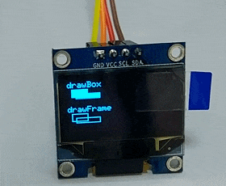
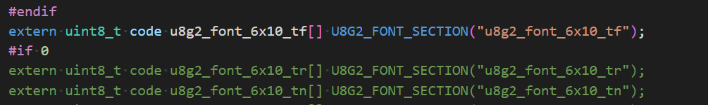
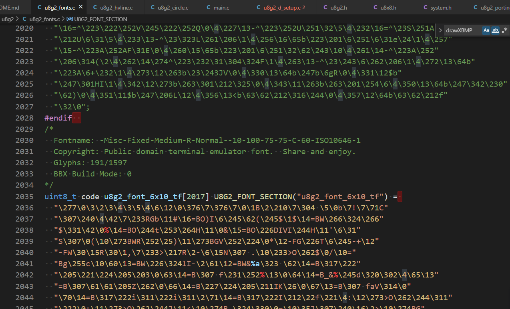

# STC32_Base_SSD1306_OLED_DRV
本项目将Arduino 中常用的图形库U8g2，移植入STC32 中。

# 使用注意事项

1. 在处理的时候需要注意 不要绘制到屏幕以外的区域，否则可能导致设备跑飞
2. 目前没有适配SPI驱动
3. 使用STClink1D时，在下载完程序需要手动复位单片机（PS：单片机的复位IO 需要在ISP中进行使能才可使用）
4. 本工程仅在STC32G12K128Beat LQFP64 上进行了测试，如有bug请issues me。

# 程序测试：

在默认的工程中添加了一个测试Demo，演示了文字显示和图像显示信息。

注：程序默认使用内部11.0592MHz晶振。

# 代码使用注意事项

## 1. 字体的切换和使用方法

因Keil 80251 编译器不支持将未使用的代码不编译到Bin文件中，因此不是用的字库文件默认是进行屏蔽处理的。在使用时候请参考[u8g2Wiki fonts](https://github.com/olikraus/u8g2/wiki/fntlist8x8) 介绍对相应字体进行解除屏蔽，相应的不是用的字体也要进行屏蔽操作，以节约ROM占用。操作方法如下：
1. 首先打开`u8g2.h` 文件，将需要使用的字体声明使用`#if`和`#endif`解除屏蔽。

2. 打开`u8g2_fonts.h`文件，使用上一步的方法对需要使用的字体的定义进行解除屏蔽。

## 2. 不同型号屏幕的使用

U8g2 的强大之处在于内部集成了诸多的点阵屏驱动，我们可以不用在编写繁琐的屏幕驱动，而专心于应用逻辑的开发。具体的屏幕支持情况可以参考[u8g2setupcpp · olikraus/u8g2 Wiki (github.com)](https://github.com/olikraus/u8g2/wiki/u8g2setupcpp#st7920-128x64)

如要使能一款驱动芯片仅需在`u8g2.h`的631行-1367行中将其注释解除，并且在`u8g2_d_setup.c`中对其定义也解除屏蔽即可。

注：目前我只适配测试IIC驱动后面将会添加SPI低层驱动的支持

## 3. API的使用

相关API的使用可以参考官方介绍：

[u8x8reference · olikraus/u8g2 Wiki (github.com)](https://github.com/olikraus/u8g2/wiki/u8x8reference)

# 参考

1. [U8glib library for monochrome displays](https://github.com/olikraus/u8g2)
2. [rt-u8g2: U8g2 for rt-thread - a monochrome graphics library](https://github.com/wuhanstudio/rt-u8g2)